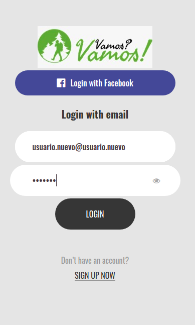

# MAC6909-Vamos

Projeto da disciplina "Empreendedorismo Digital".

# Instalação

  - Criar um Bando de Datos em Mysql-server. O banco de dados está no folder database. O nome do arquivo é "database_vamos.sql"
  - Instalar um Apacheserv que possa compilar arquivos em .php. Copiar tudo o conteúdo do folder "code" para o folder que é acessado pelo server. 
  
  - Modificar o arquivo "code/includes/config.php" para ter conexão com o Banco de Dados. 
  
  - O resutado final foi hospedado https://webvamos.000webhostapp.com/index.php. 
  
  A seguir, temos algumas capturas de tela. 
  

## Tela de Inicio

         

## Tela de Criação de um novo usuário

         

         

## Tela de Categorias dos Eventos

         

         

         

         

         

         

